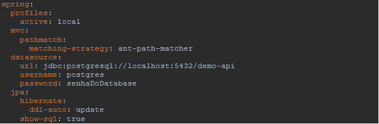
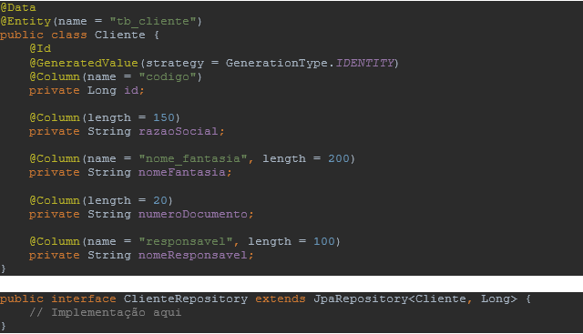
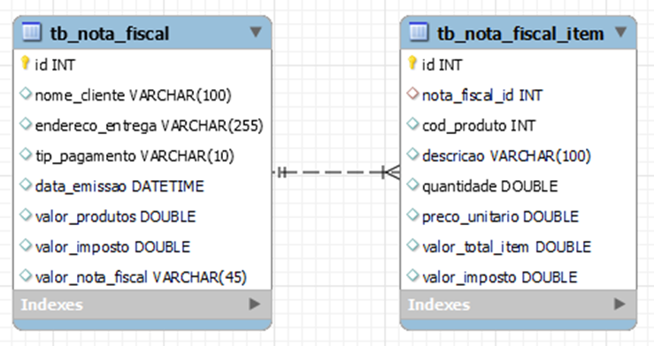
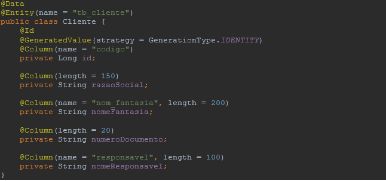
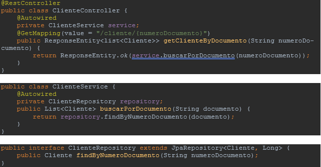
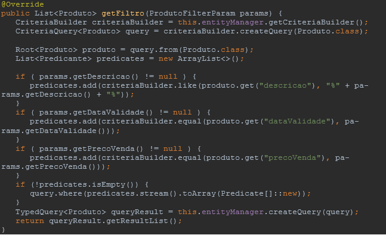

# Sprint 5 - Persistência de Dados

**1 -** O que é Spring Data JPA? Explique sua relação com JPA

**2** - Para o correto funcionamento da comunicação entre o micro serviço e o Banco de Dados, foi preciso ajustar o arquivo “application.yml” conforme destacado no código abaixo. O que é a configuração “**ddl-auto: update**”?

**3** - Para manipular o banco de dados e os registros de suas tabelas, o Spring Data JPA utiliza o conceito de ORM, Mapeamento Objeto Relacional em português. Dito isto, como uma classe de modelo deve ser configurada de modo que seja visualizada pelo ORM?

**4 -** Quais são as diferenças entre uma abordagem “Code First” e uma abordagem “Database First”?

**5** - Por que quando utilizamos o recurso JpaRepository, não é necessário codificar os comandos SQL?

**6** - Dado a classe “Cliente” e o repositório “ClienteRepository” apresentados abaixo, implemente um método capaz de filtrar a tabela por número de documento e por nome do Responsável, considerando apenas parte do nome. Este método pode retornar mais de um cliente.

**7 -** Dado as tabelas “tb_nota_fiscal” e “tb_nota_fiscal_item” apresentadas abaixo. Construa as classes de modelo que as representam, considerando o relacionamento entre elas.

**8 -** Dado a classe Cliente representada abaixo, implemente um método “filtro” no controller ClienteController, de modo que seja permitido filtrar os clientes por: RazaoSocial, NomeFantasia, NumeroDocumento e NomeResponsavel. A URL do endpoint deve permitir que o usuário informe apenas os campos desejados, conforme exemplo.

Exemplo de Requisição

**http://localhost:8080/produtos/filtro?dataValidade=2022-12-04&precoVenda=12**

**9** - Dado o exemplo da questão anterior, apresente a implementação completa do CriteriaBuilder para filtrar os clientes de acordo com o formulário de parâmetros.

**10** - Baseado na solução do exercício anterior, quais são as etapas para construção do CriteriaBuilder?

**11** - Considerando as diferenças entre abordagem “**Code First**” e “**Database First**”. Explique qual é cenário mais adequado para cada abordagem. Justifique sua resposta.

**12** - Dados a implementação das classes abaixo que filtram os clientes por documento, analise o código e aponte onde está o erro de implementação:

**13** - Considerando a implementação de pesquisa por Criteria da entidade “Produto” representada abaixo, refatore o código de forma que o filtro aplicado considere os valores maiores ou iguais ao informado no parâmetro.

**14 -** A interface CriteriaBuilder, que utilizamos como apoio para construção de Filtros, possui diversos tipos de predicados, como por exemplo “criteriaBuilder.equal()”. Explique qual é a principal diferença entre os predicatos “criteriaBuilder.greaterThan” e “criteriaBuilder.gt()”

**15** - Dado a interface “ProdutoRepository”, considerando que seja necessário implementar um novo filtro na entidade “Produto”, buscando por descrição e dataValidade, porem é preciso retornar mais de um registro (Lista de Produtos). Podemos criar um novo método com o mesmo nome?

