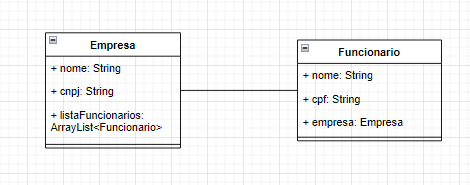
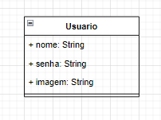

# Exercícios - Sprint 5 - Prático

1. Crie uma API para um sistema de gerenciamento de tarefas. Cada tarefa deve ter um título, uma descrição e uma data de vencimento. Os usuários podem criar, editar e excluir tarefas. Crie operações CRUD para tarefas e usuários. Com base nessa API criada na Sprint 4 integre ela com um Banco de Dados usando JPA.
2. Crie uma API para um sistema de gerenciamento de eventos. Cada evento deve ter um nome, uma descrição, uma data e uma lista de participantes. Os usuários podem se inscrever para participar de eventos e ver a lista de participantes. Crie operações CRUD para eventos e usuários. Com base nessa API criada na Sprint 4 integre ela com um Banco de Dados usando JPA.
3. Crie uma API para um sistema de gerenciamento de pedidos de comida. Cada pedido deve ter um nome do cliente, um endereço de entrega, um valor total e uma lista de itens pedidos. Os usuários podem criar, editar e excluir pedidos. Crie operações CRUD para pedidos e usuários. Com base nessa API criada na Sprint 4 integre ela com um Banco de Dados usando JPA.
4. Crie uma API com base no Diagrama de Classes a seguir. A API deve realizar operações CRUD para ambas as classes, sua API também deve ser devidamente documentada por meio do Swagger. Com base nessa API criada na Sprint 4 integre ela com um Banco de Dados usando JPA.

5. Crie uma API com base no Diagrama de Classes a seguir. Permitindo a criação de um Usuário de um sistema, o sistema deve realizar o CRUD do Usuário e permitir o cadastramento de uma imagem que ficará salva na API. (o atributo imagem recebe a rota onde a imagem ficará localizada, mas o arquivo da imagem em si também deve ser salva pela API). Com base nessa API criada na Sprint 4 integre ela com um Banco de Dados usando JPA.
    
    Sugestão de leitura:
    
    [https://www.codejava.net/frameworks/spring-boot/spring-boot-file-upload-tutorial](https://www.codejava.net/frameworks/spring-boot/spring-boot-file-upload-tutorial)
    
    [https://spring.io/guides/gs/uploading-files/](https://spring.io/guides/gs/uploading-files/)
    

